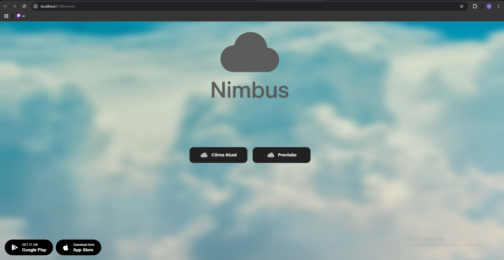
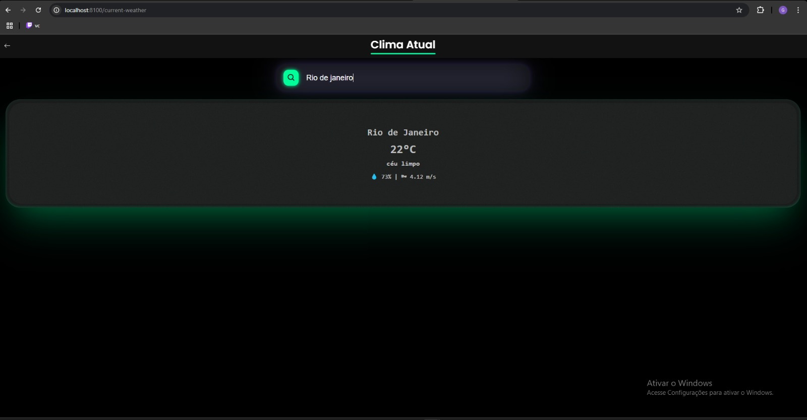
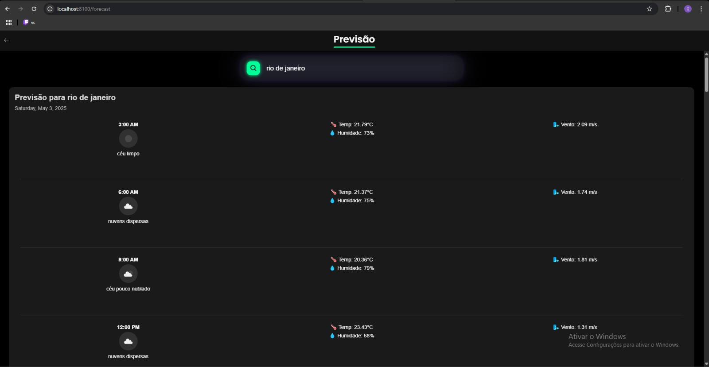

UNIVERSIDADE AUGUSTO MOTTA (UNISUAM)  
CURSO DE TECNOLOGIA EM ANÁLISE E DESENVOLVIMENTO DE SISTEMAS  
MÓDULO: DESENVOLVIMENTO MOBILE  

Aluno: Gabriel de Lima Mufalani de Assis  
Professor: Oswaldo  
Data: 02 de maio de 2025  

RELATÓRIO DE ATIVIDADE PRÁTICA  
Aplicativo de Previsão do Tempo utilizando Ionic e API OpenWeather

---

1. OBJETIVO

O objetivo desta atividade foi desenvolver um aplicativo mobile, utilizando o framework Ionic, que realizasse chamadas a uma API pública (OpenWeather) para exibir informações climáticas, incluindo o clima atual e a previsão do tempo. O projeto visa aplicar conceitos de desenvolvimento mobile, consumo de APIs REST, manipulação de dados assíncronos, estruturação de múltiplas páginas com navegação entre elas, e estilização personalizada da interface.

---

2. FERRAMENTAS UTILIZADAS

- Framework: Ionic  
- Linguagem: TypeScript, HTML, SCSS  
- API: OpenWeather (https://openweathermap.org/)  
- Ambiente de desenvolvimento: Visual Studio Code  
- Dependências: Angular, HttpClientModule  

---

3. ESTRUTURA DO APLICATIVO

O aplicativo é composto por três páginas principais:

- Home: Tela inicial com fundo estilizado, botões para navegação e destaque visual.  
- Clima Atual: Mostra as condições atuais da cidade pesquisada.  
- Previsão do Tempo: Exibe previsão detalhada para as próximas horas, com ícones, temperatura, umidade e velocidade do vento.  

---

4. FUNCIONALIDADES

- Entrada do nome da cidade pelo usuário.  
- Botão de busca ativando chamada à API.  
- Exibição dos dados climáticos formatados e estilizados.  
- Navegação fluida entre as páginas.  
- Feedback visual em caso de erro (ex.: cidade inválida).  

---

5. CÓDIGOS PRINCIPAIS

5.1 current-weather.page.ts (Clima Atual)

```ts

import { Component } from '@angular/core';
import { CommonModule } from '@angular/common';
import { IonicModule } from '@ionic/angular';
import { FormsModule } from '@angular/forms';

import { WeatherService } from '../services/weather.service';

@Component({
  selector: 'app-current-weather',
  standalone: true,
  imports: [CommonModule, IonicModule, FormsModule],
  templateUrl: './current-weather.page.html',
  styleUrls: ['./current-weather.page.scss'],
})
export class CurrentWeatherPage {
  city: string = '';
  weatherData: any;
  erro: string = '';

  constructor(private weatherService: WeatherService) {}
  voltar() {
    window.history.back();
  }

  async buscarClima() {
    this.erro = '';
    try {
      this.weatherData = await this.weatherService.getCurrentWeather(this.city);
    } catch (error) {
      this.erro = 'Erro ao buscar o clima. Verifique o nome da cidade.';
      this.weatherData = null;
    }
  }
}

```

5.2 home.page.ts

```ts

import { Component } from '@angular/core';
import { IonicModule } from '@ionic/angular';
import { RouterModule } from '@angular/router';

@Component({
  selector: 'app-home',
  standalone: true,
  imports: [IonicModule, RouterModule],
  templateUrl: 'home.page.html',
  styleUrls: ['home.page.scss'],
})
export class HomePage {}


```
5.3 forecast.page.ts (Previsão do Tempo)

```ts
export class ForecastPage {
  city: string = '';
  forecastData: any = null;
  erro: string = '';

  constructor(private weatherService: WeatherService) {}

  voltar() {
    window.history.back();
  }
  
  buscarPrevisao() {
    this.forecastData = null;
    this.erro = '';

    this.weatherService.getForecast(this.city).subscribe({
      next: (data) => this.forecastData = data,
      error: () => this.erro = 'Erro ao buscar a previsão. Verifique o nome da cidade.'
    });
  }
}
```
5.4 weather.service.ts (Serviço de API)

```ts
@Injectable({
  providedIn: 'root',
})
export class WeatherService {
  private apiKey = 'chave_api';
  private baseUrl = 'https://api.openweathermap.org/data/2.5';

  constructor(private http: HttpClient) {}

  getCurrentWeather(city: string) {
    const url = `${this.baseUrl}/weather?q=${city}&appid=${this.apiKey}&units=metric&lang=pt_br`;
    return firstValueFrom(this.http.get(url));
  }

  getForecast(city: string): Observable<any> {
    return this.http.get(`${this.baseUrl}/forecast?q=${city}&units=metric&appid=${this.apiKey}&lang=pt`);
  }
}
```

---

6. ESTILIZAÇÃO

Todo o app segue um tema escuro, com cores vibrantes para contraste visual, como verde neon em botões, além de sombras e animações sutis para melhorar a experiência do usuário. O layout responsivo foi pensado para se adaptar bem em dispositivos móveis.

---

7. RESULTADOS E FUNCIONAMENTO

Home Page:




Tela de Clima Atual:



Tela de Previsão:



---

8. CONCLUSÃO

A atividade permitiu aplicar na prática os conhecimentos adquiridos no módulo de Desenvolvimento Mobile. Foi possível desenvolver um aplicativo funcional com múltiplas páginas, consumo de APIs em tempo real e estilização moderna. A experiência reforçou a importância da integração entre frontend e backend em aplicativos móveis modernos.
